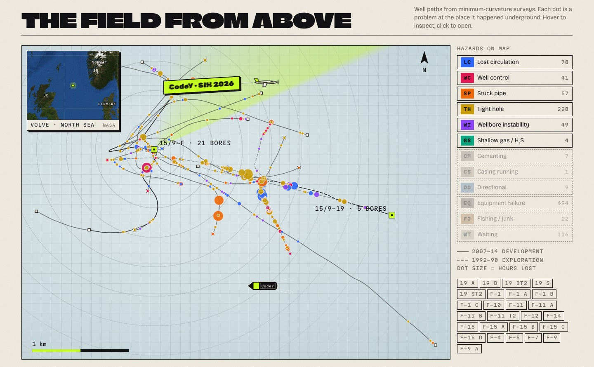
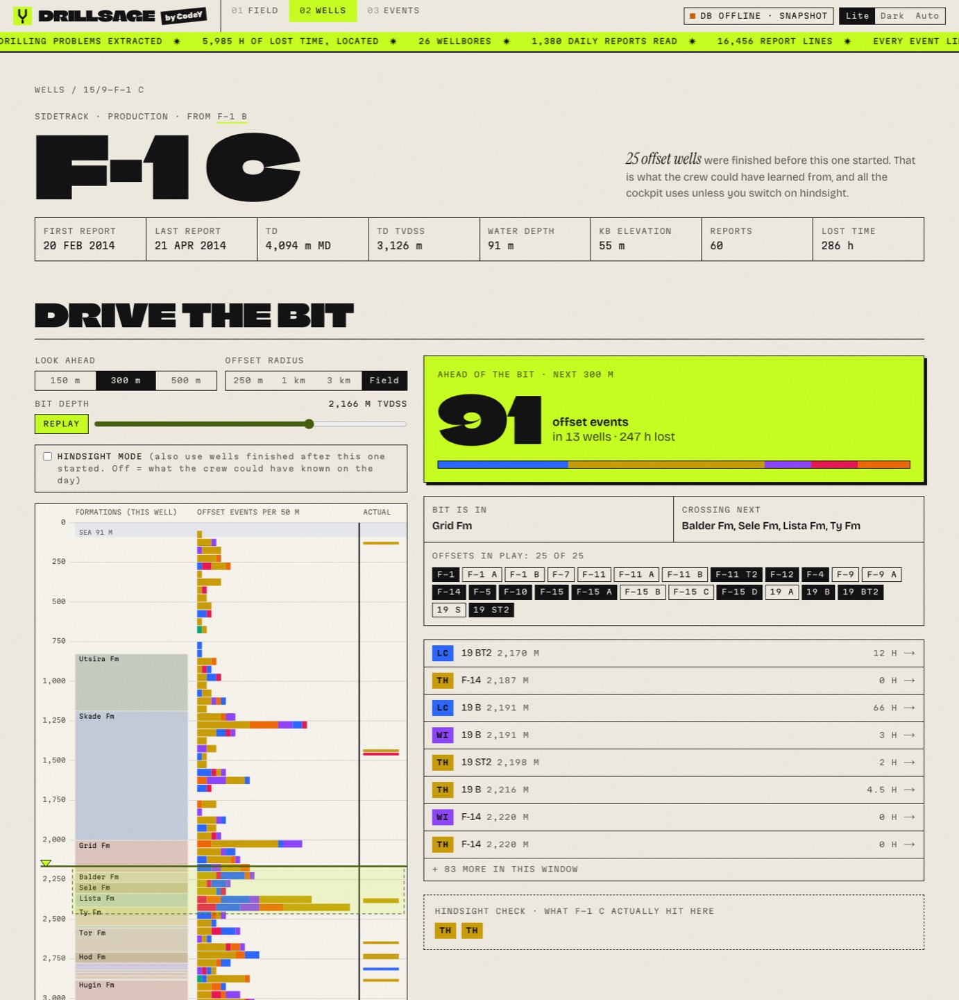
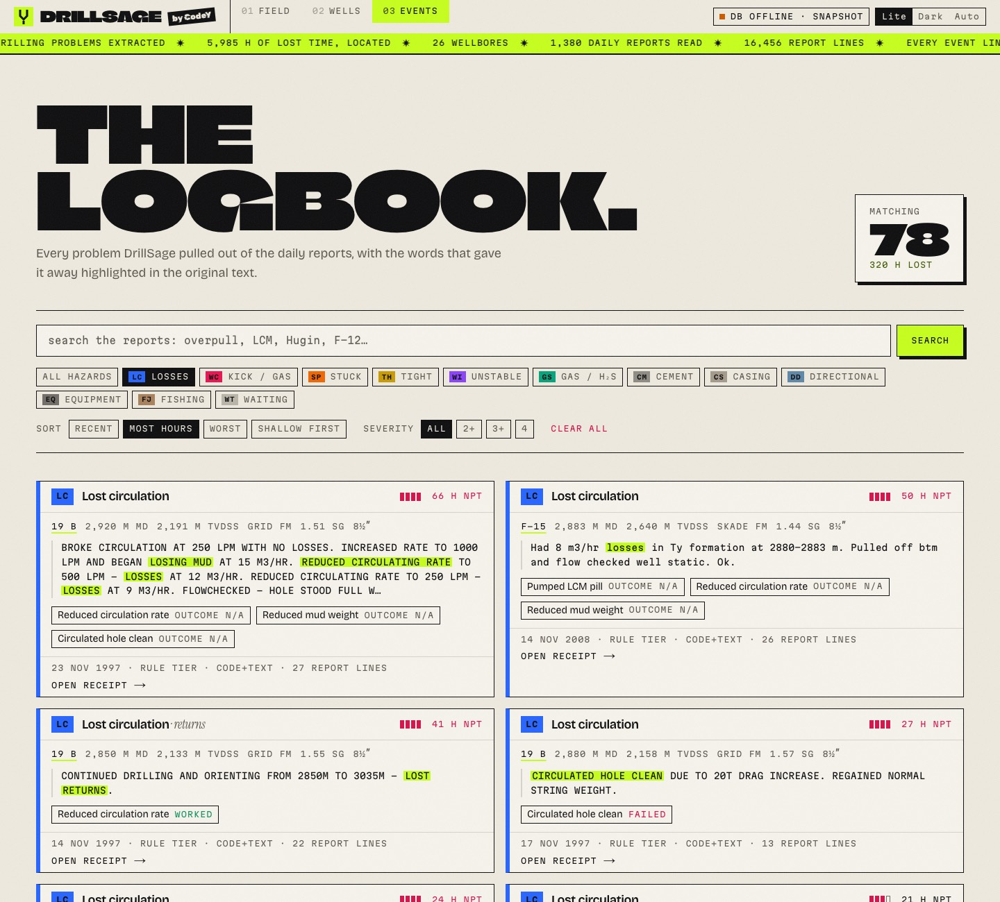
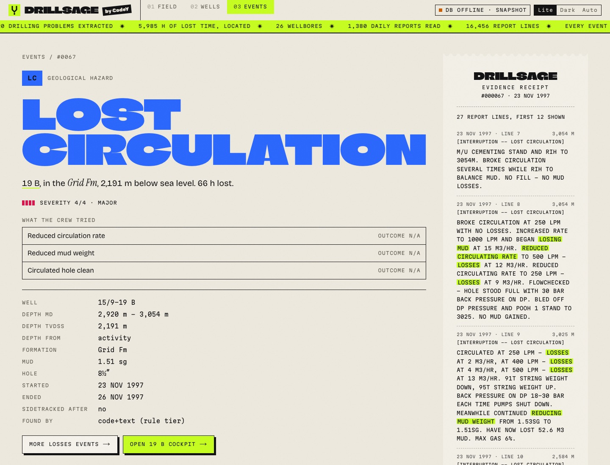

<div align="center">

# DRILLSAGE

**see trouble before the bit does.**

[**drillsage-web.onrender.com**](https://drillsage-web.onrender.com) &nbsp;·&nbsp; SIH 2026 · SIH26121 · Oil India &nbsp;·&nbsp; made by team **CodeY**

<sub>free tier: if it naps, give it ~60 s to wake up</sub>


</div>

## the pitch, in one breath

Every well you drill has neighbours that already hit the losses, kicks, stuck pipe and tight
spots waiting for you. That knowledge is buried in thousands of daily drilling reports nobody
has time to read. DrillSage reads all of them, pins every problem to a depth and a formation,
and lights up the depth strip **before your bit gets there**, with a receipt quoting the exact
report line behind every warning.

## receipts, not vibes

| | |
|---|---|
| **1,380** | real daily drilling reports parsed (WITSML), **0** values dropped |
| **1,120** | drilling problems extracted, **460** of them geological |
| **5,985 h** | of lost time located by depth and formation |
| **26** | wellbores, 1992 to 2014, surveyed paths and formation tops |

Real data from Equinor's Volve field, North Sea. The UI never shows a number it can't point
back to a report line.

## the tour

**The field from above.** Every well path, every problem where it happened underground.
Real NASA satellite inset, sonar sweep, and yes, that's our plane.



**Drive the bit.** Drag the bit down the hole (or hit Replay). The panel counts what offset
wells hit in the next 300 m. Honest by default: only wells finished *before* this one started.



**The logbook.** Search 1,120 events. The words that gave each one away are highlighted in
the original report.



**The receipt.** Every event prints its evidence, line by line.



## what's under the hood

- **Parser**: XXE-safe WITSML 1.4 DDR parser, unit-normalised, golden-tested
- **Geometry**: minimum-curvature trajectories reconciled with reported TVD; ED50 to WGS84
- **Extraction**: operator codes + tuned phrase lexicon + LLM tier that must quote the report verbatim
- **Stack**: FastAPI · Pydantic · Postgres/pgvector · Next.js 15 · Tailwind 4 · hand-drawn SVG (no chart libs, no icon packs)

## run it yourself

```bash
make setup                 # deps (uv + pnpm)
make data-fetch            # pull the public Volve reports + Sodir tables
make ui                    # API :8000 + web :3000, no Docker needed
```

Deploying your own copy: [docs/deploy.md](docs/deploy.md).

## credits

Built by **team CodeY** for Smart India Hackathon 2026.

Contains data from the Volve field dataset, released by Equinor and the Volve licence partners
under [CC BY-NC-SA 4.0](https://creativecommons.org/licenses/by-nc-sa/4.0/). Wellbore
coordinates and formation tops from the Norwegian Offshore Directorate (Sodir) FactPages
(NLOD). Locator imagery: NASA Blue Marble (public domain). Non-commercial use only.
